# CinemaVision Pro - Diagrams (Sơ Đồ Hệ Thống)

> **Project:** CinemaVision Pro - Online Movie Ticket Booking System
> **Group:** 7 - SE113.Q11 - UIT
> **Date:** April 12, 2026

---

## Table of Contents

- [1. Context Diagram (Level 0 DFD)](#1-context-diagram-level-0-dfd)
- [2. Simplified Context Diagram](#2-simplified-context-diagram)
- [3. Visitor ↔ System Data Flows](#3-visitor--system-data-flows)
- [4. Registered User ↔ System Data Flows](#4-registered-user--system-data-flows)
- [5. Administrator ↔ System Data Flows](#5-administrator--system-data-flows)
- [6. System ↔ MongoDB Atlas](#6-system--mongodb-atlas)
- [7. System ↔ Email SMTP Server](#7-system--email-smtp-server)
- [8. System ↔ Web Browser](#8-system--web-browser)
- [9. Level 1 DFD — Decomposition](#9-level-1-dfd--decomposition)
- [10. Process 1.0: Authentication & User Management](#10-process-10-authentication--user-management)
- [11. Process 4.0: Booking Management](#11-process-40-booking-management)
- [12. Booking Flow — Detailed Flowchart](#12-booking-flow--detailed-flowchart)

---

## 1. Context Diagram (Level 0 DFD)

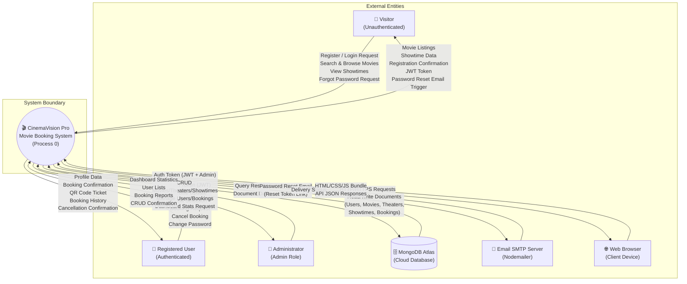

---

## 2. Simplified Context Diagram

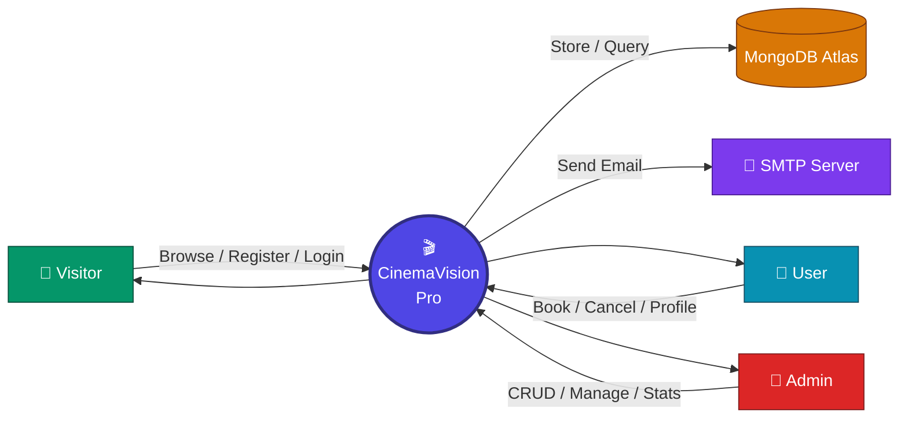

---

## 3. Visitor ↔ System Data Flows

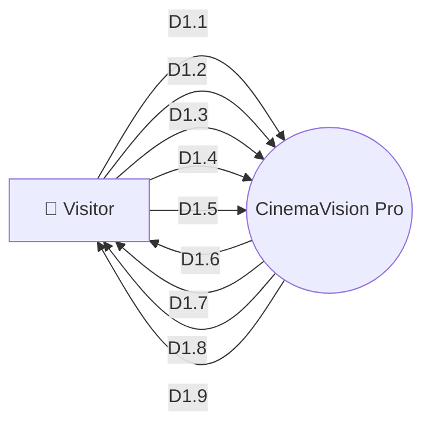

---

## 4. Registered User ↔ System Data Flows

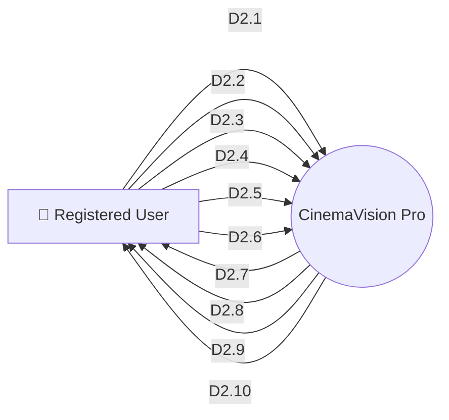

---

## 5. Administrator ↔ System Data Flows

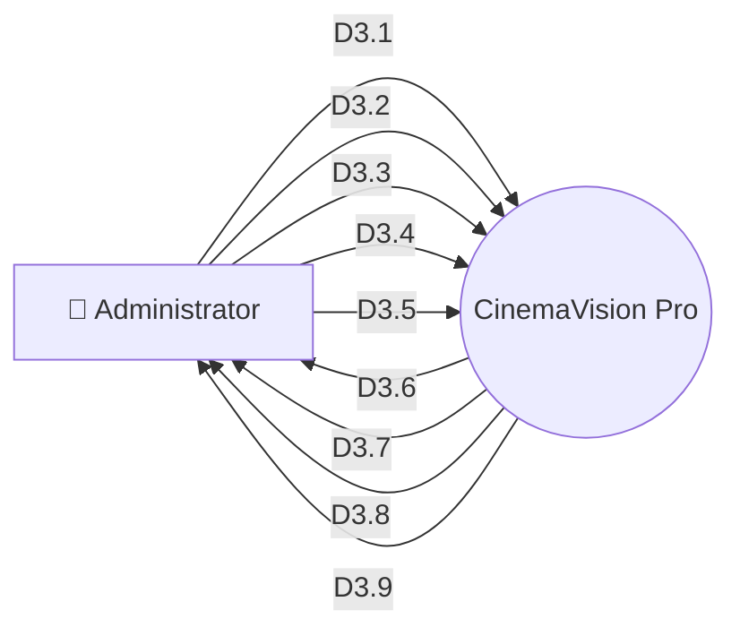

---

## 6. System ↔ MongoDB Atlas

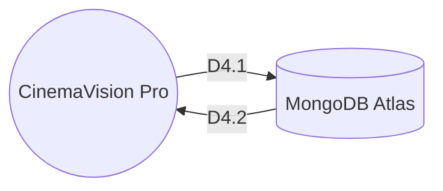

---

## 7. System ↔ Email SMTP Server

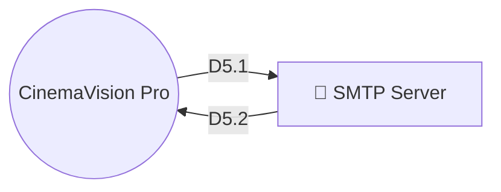

---

## 8. System ↔ Web Browser

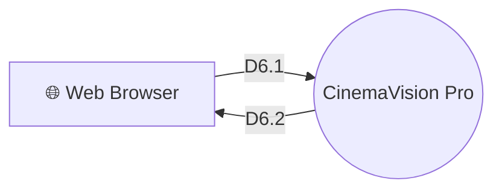

---

## 9. Level 1 DFD — Decomposition

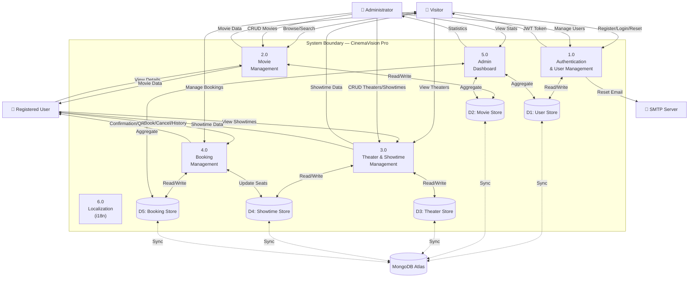

---

## 10. Process 1.0: Authentication & User Management

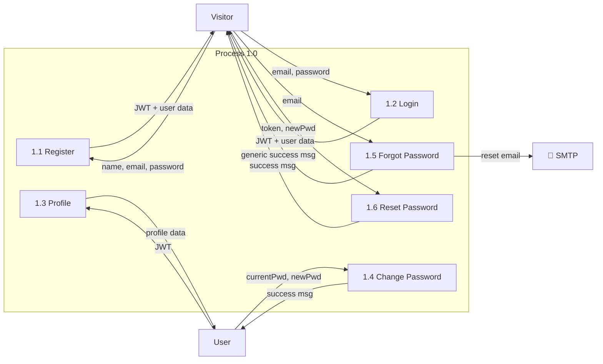

---

## 11. Process 4.0: Booking Management

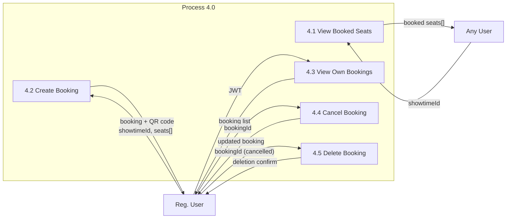

---

## 12. Booking Flow — Detailed Flowchart

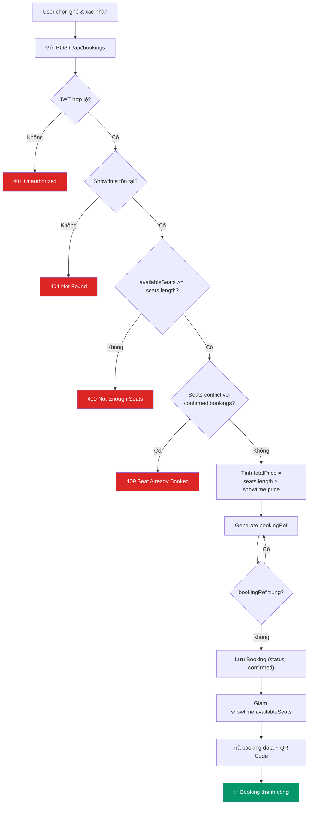

---

**Prepared by:** Group 7 - SE113.Q11 - UIT
**Last Updated:** April 12, 2026
