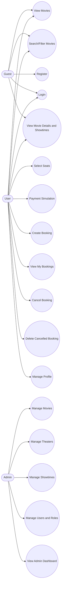
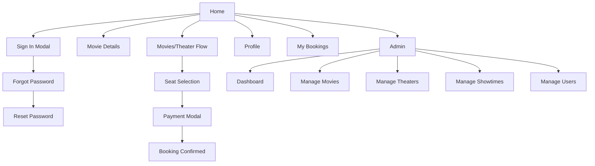
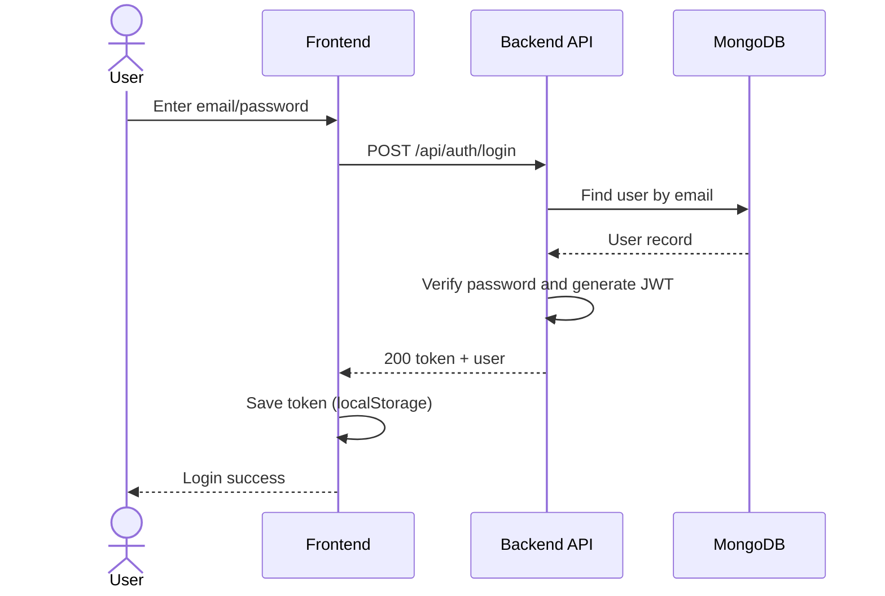
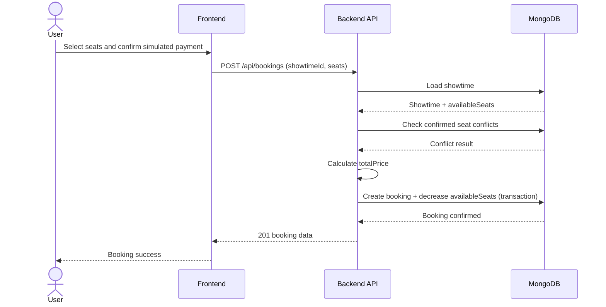
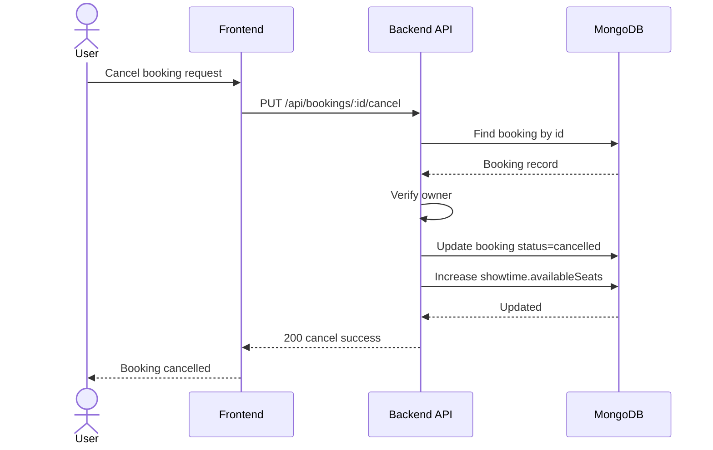

# CinemaVision Requirements List

> Project: CinemaVision Pro  
> Version: 1.1  
> Date: March 18, 2026

---

## 1. User Requirements (UR)

| ID | User Requirement | Priority |
|----|------------------|----------|
| UR-01 | Guest can view current movies. | High |
| UR-02 | Guest/User can search and filter movies by keyword, genre, rating, duration. | High |
| UR-03 | User can register with email and password. | High |
| UR-04 | User can sign in and sign out securely. | High |
| UR-05 | User can request forgot-password and reset password via email token. | High |
| UR-06 | User can view movie details and showtimes by theater/region/date. | High |
| UR-07 | User can select seats on a visual seat map. | High |
| UR-08 | User can complete payment with simulation options (ATM/Momo/ZaloPay/VNPay). | Medium |
| UR-09 | User can create booking and receive confirmed status. | High |
| UR-10 | User can view personal booking history. | High |
| UR-11 | User can cancel own booking. | High |
| UR-12 | User can delete own cancelled booking. | Medium |
| UR-13 | User can update profile and change password. | High |
| UR-14 | Admin can manage movies (CRUD). | High |
| UR-15 | Admin can manage theaters (CRUD). | High |
| UR-16 | Admin can manage showtimes (CRUD). | High |
| UR-17 | Admin can manage users and roles. | High |
| UR-18 | Admin can view dashboard stats and all bookings. | High |
| UR-19 | User can use EN/VI locale and VND/USD currency display. | Medium |
| UR-20 | System shows a 404 page for unknown URL. | Medium |

---

## 2. System Requirements (SR)

### 2.1 Functional Requirements

| ID | System Requirement |
|----|--------------------|
| SR-F01 | System provides auth APIs: `/auth/register`, `/auth/login`, `/auth/profile`, `/auth/change-password`, `/auth/forgot-password`, `/auth/reset-password/:token`. |
| SR-F02 | System issues JWT at successful login/register and validates token for protected endpoints. |
| SR-F03 | Only role `admin` can access `/api/admin/*` and movie/theater/showtime CRUD APIs. |
| SR-F04 | System provides movie search/filter/sort/pagination via `/api/movies/search`. |
| SR-F05 | System provides theaters by region and showtimes by movie/theater/date. |
| SR-F06 | On booking creation, system validates showtime existence, available seats, and no conflict with confirmed seats. |
| SR-F07 | Backend computes total price as `seats.length * showtime.price`. |
| SR-F08 | On successful booking, system decreases `showtime.availableSeats`; on cancel it restores seat count. |
| SR-F09 | User can cancel/delete only own booking; delete is allowed only for `cancelled` status. |
| SR-F10 | System generates unique `bookingReference` per booking. |
| SR-F11 | System exposes public endpoint to read booked seats by showtime. |
| SR-F12 | Admin role update is supported, but self-demote and self-delete are blocked. |

### 2.2 Non-functional Requirements

| ID | System Requirement |
|----|--------------------|
| SR-N01 | Password must be hashed by bcrypt before persistence. |
| SR-N02 | API must enforce global rate limit (1000 requests/IP/15 minutes). |
| SR-N03 | API must use `helmet`, CORS from `FRONTEND_URL`, and JSON body limit 10MB. |
| SR-N04 | Protected APIs return HTTP 401 for missing/invalid/expired token. |
| SR-N05 | System provides health endpoint `/api/health`. |
| SR-N06 | Frontend is responsive and includes 404 route page. |

---

## 3. Use Case Diagram

---

## 4. Use Case Specifications

### UC-01: User Login
- **Primary Actor:** User
- **Preconditions:** User account exists.
- **Main Flow:**
1. User enters email and password.
2. Frontend calls `POST /api/auth/login`.
3. Backend validates credentials.
4. Backend returns JWT token and user info.
5. Frontend stores token and sets authenticated state.
- **Alternative Flows:**
1. Invalid email/password -> HTTP 401.
2. Server error -> HTTP 500.
- **Postconditions:** User is authenticated and can access protected APIs.

### UC-02: Create Booking
- **Primary Actor:** User
- **Preconditions:** User is logged in; showtime exists.
- **Main Flow:**
1. User chooses showtime.
2. User selects seats.
3. User confirms simulated payment in modal.
4. Frontend calls `POST /api/bookings`.
5. Backend validates seats, computes total price, creates booking, updates available seats.
6. System returns confirmed booking.
- **Alternative Flows:**
1. Seat conflict -> HTTP 400.
2. Not enough available seats -> HTTP 400.
3. Expired token -> HTTP 401.
- **Postconditions:** Booking status is `confirmed`, available seats reduced.

### UC-03: Cancel Booking
- **Primary Actor:** User
- **Preconditions:** User is logged in; booking belongs to user.
- **Main Flow:**
1. User requests cancel booking.
2. Frontend calls `PUT /api/bookings/:id/cancel`.
3. Backend verifies ownership.
4. Backend sets booking status to `cancelled`.
5. Backend restores seats to `showtime.availableSeats`.
- **Alternative Flows:**
1. Booking not found -> HTTP 404.
2. Not owner -> HTTP 403.
- **Postconditions:** Booking is cancelled successfully.

### UC-04: Admin Manage Movies
- **Primary Actor:** Admin
- **Preconditions:** Admin is authenticated.
- **Main Flow:**
1. Admin opens movie management screen.
2. Admin performs create/update/delete movie.
3. Frontend calls movies API with admin token.
4. Backend checks admin role and processes CRUD.
- **Alternative Flows:**
1. Non-admin request -> HTTP 403.
2. Invalid payload -> HTTP 400.
- **Postconditions:** Movie data is updated in database.

---

## 5. Prototype (Wireframe Level)

### 5.1 Public/Guest Screens
- `Home`: hero + featured movies + search.
- `Movie Details`: movie info + showtimes.
- `Sign In / Sign Up`: auth form + forgot password.

### 5.2 User Screens
- `Theater Flow`: region -> theater -> movie -> showtime.
- `Seat Selection`: seat map + legend + summary.
- `Payment Modal`: simulated payment method selection.
- `My Bookings`: booking list with cancel/delete actions.
- `Profile`: edit profile + change password.

### 5.3 Admin Screens
- `Admin Dashboard`: totals for users, movies, showtimes, bookings, revenue.
- `Movie Management`: CRUD movies.
- `Theater Management`: CRUD theaters.
- `Showtime Management`: CRUD showtimes.
- `User Management`: role update and delete with policy checks.

### 5.4 Navigation Prototype Map

---

## 6. Sequence Diagrams

### 6.1 Sequence: Login

### 6.2 Sequence: Create Booking

### 6.3 Sequence: Cancel Booking

---

## 7. Traceability (Quick Map)

| Area | Main Code References |
|------|----------------------|
| Auth and Profile | `backend/server/controllers/authController.js`, `backend/server/middleware/auth.js`, `frontend/src/lib/auth.tsx` |
| Movies | `backend/server/controllers/movieController.js`, `backend/server/routes/movies.js` |
| Theaters/Showtimes | `backend/server/controllers/theaterController.js`, `backend/server/routes/showtimes.js` |
| Booking | `backend/server/controllers/bookingController.js`, `backend/server/models/Booking.js`, `frontend/src/components/SeatSelection.tsx` |
| Admin | `backend/server/routes/adminRoutes.js`, `backend/server/controllers/adminController.js`, `frontend/src/components/admin/*` |
| Security and Platform | `backend/server/server.js` |

---

**End of Document**
