# 📋 TÀI LIỆU ĐẶC TẢ USECASE - CINEMAVISION PRO

> **Phiên bản:** 1.0  
> **Ngày tạo:** 10/12/2024  
> **Dự án:** CinemaVision Pro - Hệ thống đặt vé xem phim trực tuyến

---

## 📑 MỤC LỤC

1. [Tổng quan hệ thống](#1-tổng-quan-hệ-thống)
2. [Các Actor trong hệ thống](#2-các-actor-trong-hệ-thống)
3. [Sơ đồ Usecase tổng quan](#3-sơ-đồ-usecase-tổng-quan)
4. [Module Authentication [AUTH]](#4-module-authentication-auth)
5. [Module Movie [MOVIE]](#5-module-movie-movie)
6. [Module Booking [BOOKING]](#6-module-booking-booking)
7. [Module Payment [PAYMENT]](#7-module-payment-payment)
8. [Module Admin [ADMIN]](#8-module-admin-admin)
9. [Module Profile [PROFILE]](#9-module-profile-profile)
10. [Module System [SYS]](#10-module-system-sys)

---

## 🖼️ SƠ ĐỒ USECASE (HÌNH ẢNH)

### Sơ đồ tổng quan hệ thống
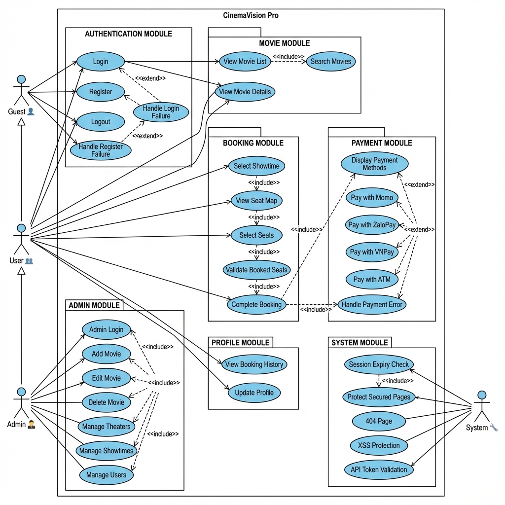

### Sơ đồ Module Authentication
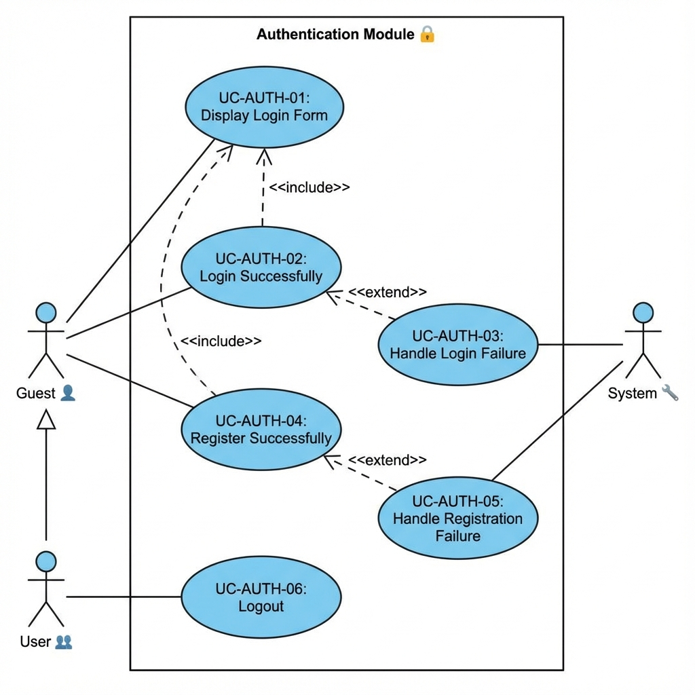

### Sơ đồ Module Booking
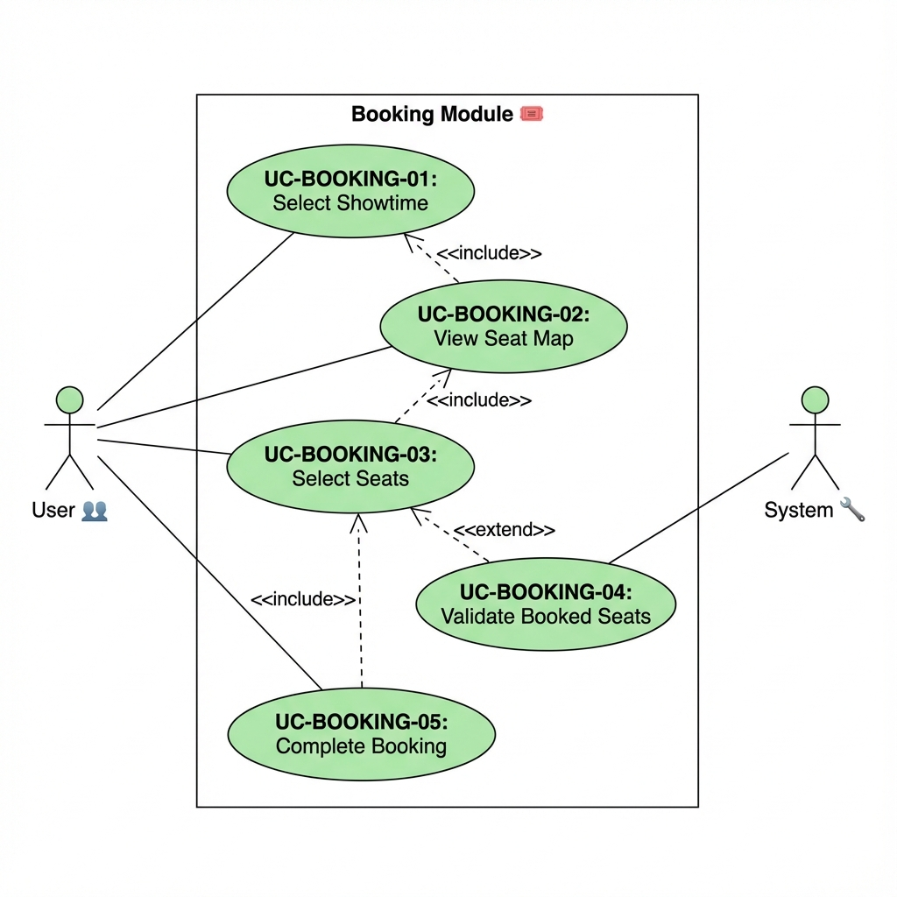

### Sơ đồ Module Payment
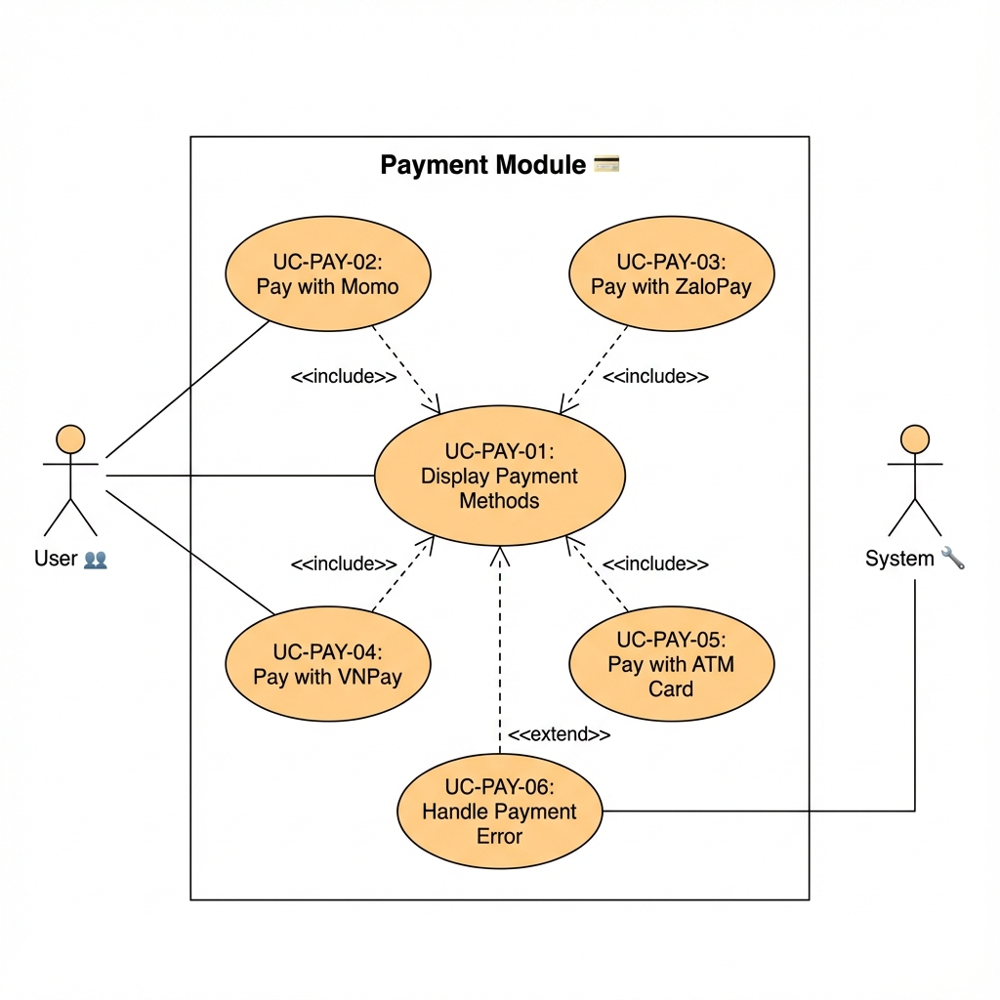

### Sơ đồ Module Admin
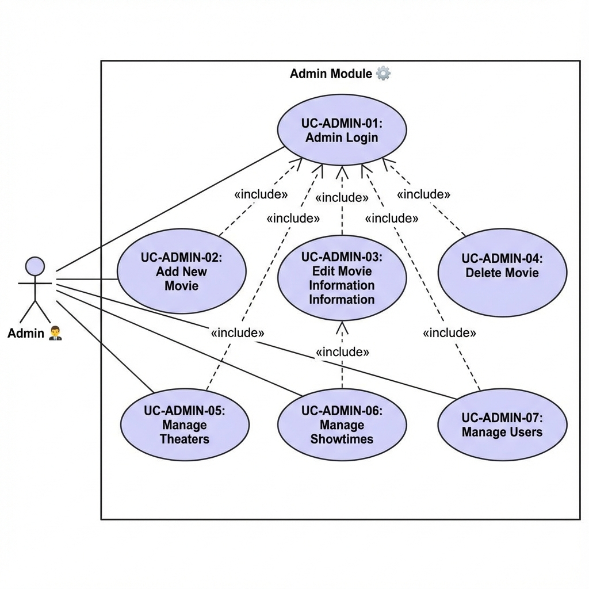

---

## 1. TỔNG QUAN HỆ THỐNG

### 1.1. Giới thiệu

**CinemaVision Pro** là một hệ thống đặt vé xem phim trực tuyến hiện đại, cho phép người dùng:
- Duyệt và tìm kiếm phim
- Xem chi tiết phim và suất chiếu
- Chọn ghế và đặt vé
- Thanh toán trực tuyến
- Quản lý thông tin cá nhân và lịch sử đặt vé

### 1.2. Phạm vi

Tài liệu này mô tả chi tiết các usecase của hệ thống, bao gồm:
- Mô tả chức năng
- Actor liên quan
- Điều kiện tiên quyết (Preconditions)
- Luồng xử lý chính (Main Flow)
- Luồng xử lý thay thế (Alternative Flow)
- Kết quả mong đợi (Postconditions)

---

## 2. CÁC ACTOR TRONG HỆ THỐNG

| Actor | Mô tả | Quyền hạn |
|-------|-------|-----------|
| 👤 **Guest** | Khách truy cập chưa đăng nhập | Xem phim, tìm kiếm |
| 👥 **User** | Người dùng đã đăng nhập | Đặt vé, thanh toán, quản lý profile |
| 👨‍💼 **Admin** | Quản trị viên hệ thống | Quản lý phim, rạp, suất chiếu, người dùng |
| 🔧 **System** | Hệ thống tự động | Xác thực, bảo mật, xử lý session |

---

## 3. SƠ ĐỒ USECASE TỔNG QUAN

### 3.1. Sơ đồ tổng quan (PlantUML)

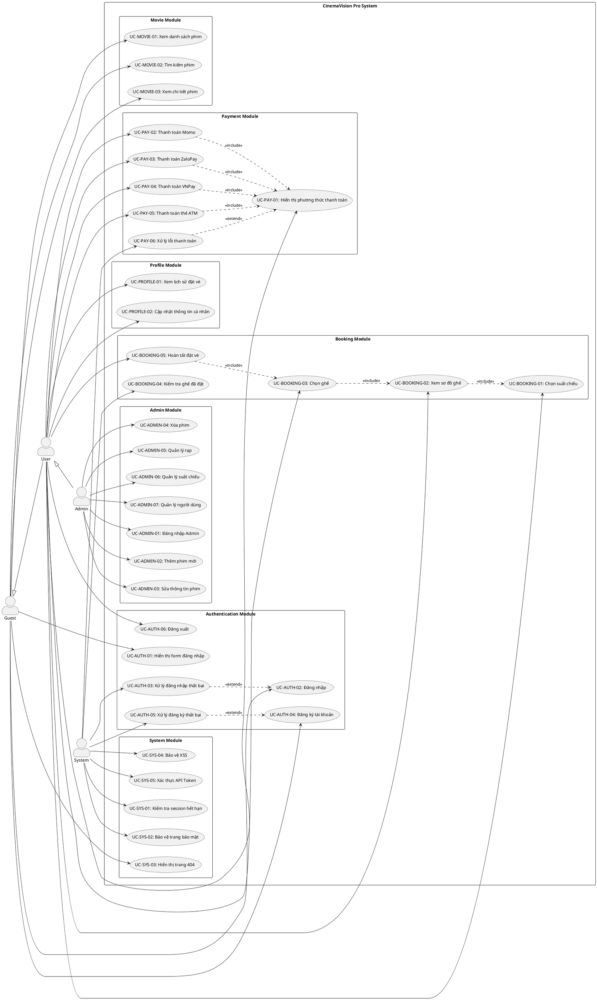
```plantuml
@startuml CinemaVision_Pro_UseCase_Overview

left to right direction
skinparam packageStyle rectangle
skinparam actorStyle awesome

' Actors
actor "Guest" as Guest
actor "User" as User
actor "Admin" as Admin
actor "System" as System

Guest <|-- User
User <|-- Admin

' Package definitions
rectangle "CinemaVision Pro System" {
    
    package "Authentication Module" {
        usecase "UC-AUTH-01: Hiển thị form đăng nhập" as AUTH01
        usecase "UC-AUTH-02: Đăng nhập" as AUTH02
        usecase "UC-AUTH-03: Xử lý đăng nhập thất bại" as AUTH03
        usecase "UC-AUTH-04: Đăng ký tài khoản" as AUTH04
        usecase "UC-AUTH-05: Xử lý đăng ký thất bại" as AUTH05
        usecase "UC-AUTH-06: Đăng xuất" as AUTH06
    }
    
    package "Movie Module" {
        usecase "UC-MOVIE-01: Xem danh sách phim" as MOVIE01
        usecase "UC-MOVIE-02: Tìm kiếm phim" as MOVIE02
        usecase "UC-MOVIE-03: Xem chi tiết phim" as MOVIE03
    }
    
    package "Booking Module" {
        usecase "UC-BOOKING-01: Chọn suất chiếu" as BOOK01
        usecase "UC-BOOKING-02: Xem sơ đồ ghế" as BOOK02
        usecase "UC-BOOKING-03: Chọn ghế" as BOOK03
        usecase "UC-BOOKING-04: Kiểm tra ghế đã đặt" as BOOK04
        usecase "UC-BOOKING-05: Hoàn tất đặt vé" as BOOK05
    }
    
    package "Payment Module" {
        usecase "UC-PAY-01: Hiển thị phương thức thanh toán" as PAY01
        usecase "UC-PAY-02: Thanh toán Momo" as PAY02
        usecase "UC-PAY-03: Thanh toán ZaloPay" as PAY03
        usecase "UC-PAY-04: Thanh toán VNPay" as PAY04
        usecase "UC-PAY-05: Thanh toán thẻ ATM" as PAY05
        usecase "UC-PAY-06: Xử lý lỗi thanh toán" as PAY06
    }
    
    package "Admin Module" {
        usecase "UC-ADMIN-01: Đăng nhập Admin" as ADMIN01
        usecase "UC-ADMIN-02: Thêm phim mới" as ADMIN02
        usecase "UC-ADMIN-03: Sửa thông tin phim" as ADMIN03
        usecase "UC-ADMIN-04: Xóa phim" as ADMIN04
        usecase "UC-ADMIN-05: Quản lý rạp" as ADMIN05
        usecase "UC-ADMIN-06: Quản lý suất chiếu" as ADMIN06
        usecase "UC-ADMIN-07: Quản lý người dùng" as ADMIN07
    }
    
    package "Profile Module" {
        usecase "UC-PROFILE-01: Xem lịch sử đặt vé" as PROF01
        usecase "UC-PROFILE-02: Cập nhật thông tin cá nhân" as PROF02
    }
    
    package "System Module" {
        usecase "UC-SYS-01: Kiểm tra session hết hạn" as SYS01
        usecase "UC-SYS-02: Bảo vệ trang bảo mật" as SYS02
        usecase "UC-SYS-03: Hiển thị trang 404" as SYS03
        usecase "UC-SYS-04: Bảo vệ XSS" as SYS04
        usecase "UC-SYS-05: Xác thực API Token" as SYS05
    }
}

' Guest relationships
Guest --> AUTH01
Guest --> AUTH02
Guest --> AUTH04
Guest --> MOVIE01
Guest --> MOVIE02
Guest --> MOVIE03
Guest --> SYS03

' User relationships
User --> AUTH06
User --> BOOK01
User --> BOOK02
User --> BOOK03
User --> BOOK05
User --> PAY01
User --> PAY02
User --> PAY03
User --> PAY04
User --> PAY05
User --> PROF01
User --> PROF02

' Admin relationships
Admin --> ADMIN01
Admin --> ADMIN02
Admin --> ADMIN03
Admin --> ADMIN04
Admin --> ADMIN05
Admin --> ADMIN06
Admin --> ADMIN07

' System relationships
System --> AUTH03
System --> AUTH05
System --> BOOK04
System --> PAY06
System --> SYS01
System --> SYS02
System --> SYS04
System --> SYS05

' Include relationships
BOOK05 ..> BOOK03 : <<include>>
BOOK03 ..> BOOK02 : <<include>>
BOOK02 ..> BOOK01 : <<include>>
PAY02 ..> PAY01 : <<include>>
PAY03 ..> PAY01 : <<include>>
PAY04 ..> PAY01 : <<include>>
PAY05 ..> PAY01 : <<include>>

' Extend relationships
AUTH03 ..> AUTH02 : <<extend>>
AUTH05 ..> AUTH04 : <<extend>>
PAY06 ..> PAY01 : <<extend>>

@enduml
```

### 3.2. Sơ đồ Mermaid (cho GitHub/GitLab)


```mermaid
graph TB
    subgraph Actors
        Guest[👤 Guest]
        User[👥 User]
        Admin[👨‍💼 Admin]
        System[🔧 System]
    end
    
    subgraph AUTH[🔐 Authentication Module]
        AUTH01[AUTH-01: Hiển thị form đăng nhập]
        AUTH02[AUTH-02: Đăng nhập thành công]
        AUTH03[AUTH-03: Đăng nhập thất bại]
        AUTH04[AUTH-04: Đăng ký thành công]
        AUTH05[AUTH-05: Đăng ký thất bại]
        AUTH06[AUTH-06: Đăng xuất]
    end
    
    subgraph MOVIE[🎬 Movie Module]
        MOVIE01[MOVIE-01: Xem danh sách phim]
        MOVIE02[MOVIE-02: Tìm kiếm phim]
        MOVIE03[MOVIE-03: Xem chi tiết phim]
    end
    
    subgraph BOOKING[🎟️ Booking Module]
        BOOK01[BOOKING-01: Chọn suất chiếu]
        BOOK02[BOOKING-02: Xem sơ đồ ghế]
        BOOK03[BOOKING-03: Chọn ghế]
        BOOK04[BOOKING-04: Kiểm tra ghế đã đặt]
        BOOK05[BOOKING-05: Hoàn tất đặt vé]
    end
    
    subgraph PAYMENT[💳 Payment Module]
        PAY01[PAYMENT-01: Hiển thị thanh toán]
        PAY02[PAYMENT-02: Thanh toán Momo]
        PAY03[PAYMENT-03: Thanh toán ZaloPay]
        PAY04[PAYMENT-04: Thanh toán VNPay]
        PAY05[PAYMENT-05: Thanh toán ATM]
        PAY06[PAYMENT-06: Xử lý lỗi]
    end
    
    Guest --> AUTH01
    Guest --> AUTH02
    Guest --> AUTH04
    Guest --> MOVIE01
    Guest --> MOVIE02
    Guest --> MOVIE03
    
    User --> AUTH06
    User --> BOOK01
    User --> BOOK02
    User --> BOOK03
    User --> BOOK05
    User --> PAY01
    
    Admin --> ADMIN_MODULE
    
    System --> AUTH03
    System --> AUTH05
    System --> BOOK04
    System --> PAY06
```

---

## 4. MODULE AUTHENTICATION [AUTH]

### 4.1. Sơ đồ Usecase Module Authentication

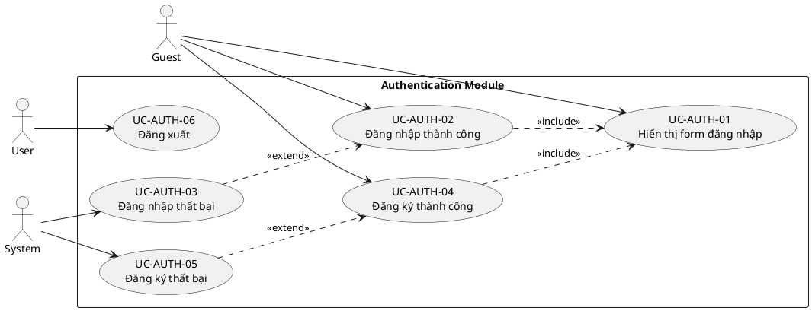
```plantuml
@startuml Authentication_UseCase

left to right direction
skinparam packageStyle rectangle

actor "Guest" as Guest
actor "User" as User
actor "System" as System

rectangle "Authentication Module" {
    usecase "UC-AUTH-01\nHiển thị form đăng nhập" as UC1
    usecase "UC-AUTH-02\nĐăng nhập thành công" as UC2
    usecase "UC-AUTH-03\nĐăng nhập thất bại" as UC3
    usecase "UC-AUTH-04\nĐăng ký thành công" as UC4
    usecase "UC-AUTH-05\nĐăng ký thất bại" as UC5
    usecase "UC-AUTH-06\nĐăng xuất" as UC6
}

Guest --> UC1
Guest --> UC2
Guest --> UC4
User --> UC6
System --> UC3
System --> UC5

UC2 ..> UC1 : <<include>>
UC4 ..> UC1 : <<include>>
UC3 ..> UC2 : <<extend>>
UC5 ..> UC4 : <<extend>>

@enduml
```

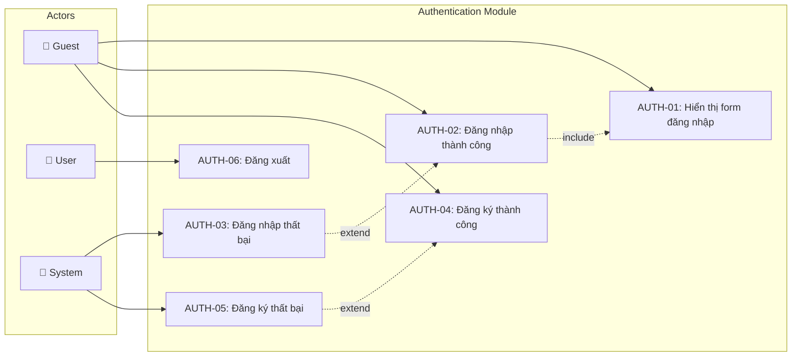
```mermaid
graph LR
    subgraph Actors
        G[👤 Guest]
        U[👥 User]
        S[🔧 System]
    end
    
    subgraph "Authentication Module"
        UC1[AUTH-01: Hiển thị form đăng nhập]
        UC2[AUTH-02: Đăng nhập thành công]
        UC3[AUTH-03: Đăng nhập thất bại]
        UC4[AUTH-04: Đăng ký thành công]
        UC5[AUTH-05: Đăng ký thất bại]
        UC6[AUTH-06: Đăng xuất]
    end
    
    G --> UC1
    G --> UC2
    G --> UC4
    U --> UC6
    S --> UC3
    S --> UC5
    
    UC2 -.->|include| UC1
    UC3 -.->|extend| UC2
    UC5 -.->|extend| UC4
```

---

### UC-AUTH-01: Hiển thị form đăng nhập

| Thuộc tính | Mô tả |
|------------|-------|
| **ID** | UC-AUTH-01 |
| **Tên** | Hiển thị form đăng nhập |
| **Actor chính** | Guest |
| **Mô tả** | Người dùng truy cập và xem form đăng nhập/đăng ký |
| **Trigger** | Người dùng nhấn nút "Login" trên navigation |

**Preconditions:**
- Người dùng chưa đăng nhập
- Trang web đã tải hoàn chỉnh

**Main Flow:**
1. Người dùng truy cập trang chủ
2. Người dùng nhấn nút "Login" (`data-testid="login-btn"`)
3. Modal đăng nhập hiển thị
4. Form hiển thị các trường: Email, Password
5. Hiển thị nút "Sign in" và "Sign up instead"

**Postconditions:**
- Modal đăng nhập hiển thị thành công
- Các trường input và button có thể tương tác

**Test Case:** `[AUTH]-01: Verify Login Form Display`

---

### UC-AUTH-02: Đăng nhập thành công

| Thuộc tính | Mô tả |
|------------|-------|
| **ID** | UC-AUTH-02 |
| **Tên** | Đăng nhập thành công |
| **Actor chính** | Guest |
| **Mô tả** | Người dùng đăng nhập vào hệ thống với thông tin hợp lệ |
| **Trigger** | Người dùng điền form và nhấn "Sign in" |

**Preconditions:**
- Form đăng nhập đang hiển thị
- Tài khoản đã tồn tại trong hệ thống

**Main Flow:**
1. Người dùng nhập email hợp lệ
2. Người dùng nhập password đúng
3. Người dùng nhấn "Sign in"
4. Hệ thống xác thực thông tin
5. Hệ thống tạo JWT token và lưu vào localStorage
6. Modal đăng nhập đóng lại
7. Nút "Logout" xuất hiện thay thế nút "Login"

**Postconditions:**
- Người dùng được đăng nhập
- JWT token được lưu
- UI cập nhật trạng thái đăng nhập

**Alternative Flow - Đăng nhập thất bại (UC-AUTH-03):**
1. Nếu email/password không đúng
2. Hiển thị thông báo "Invalid email or password"
3. Form vẫn mở để người dùng thử lại

**Test Case:** `[AUTH]-02: Login Success`, `[AUTH]-03: Login Failure`

---

### UC-AUTH-04: Đăng ký thành công

| Thuộc tính | Mô tả |
|------------|-------|
| **ID** | UC-AUTH-04 |
| **Tên** | Đăng ký tài khoản thành công |
| **Actor chính** | Guest |
| **Mô tả** | Người dùng tạo tài khoản mới |
| **Trigger** | Người dùng nhấn "Sign up instead" và điền form |

**Preconditions:**
- Form đăng nhập đang hiển thị
- Email chưa tồn tại trong hệ thống

**Main Flow:**
1. Người dùng nhấn "Sign up instead"
2. Form chuyển sang chế độ đăng ký
3. Người dùng nhập email mới
4. Người dùng nhập password
5. Người dùng nhấn "Sign up"
6. Hệ thống tạo tài khoản mới
7. Hệ thống tự động đăng nhập
8. Modal đóng lại

**Postconditions:**
- Tài khoản mới được tạo
- Người dùng được đăng nhập tự động

**Alternative Flow - Đăng ký thất bại (UC-AUTH-05):**
1. Nếu email đã tồn tại
2. Hiển thị thông báo "User already exists"
3. Form vẫn mở để người dùng sửa

**Test Case:** `[AUTH]-04: Register Success`, `[AUTH]-05: Register Failure`

---

### UC-AUTH-06: Đăng xuất

| Thuộc tính | Mô tả |
|------------|-------|
| **ID** | UC-AUTH-06 |
| **Tên** | Đăng xuất |
| **Actor chính** | User |
| **Mô tả** | Người dùng đăng xuất khỏi hệ thống |
| **Trigger** | Người dùng nhấn nút "Logout" |

**Preconditions:**
- Người dùng đang đăng nhập

**Main Flow:**
1. Người dùng nhấn nút "Logout" (`data-testid="logout-btn"`)
2. Hệ thống xóa JWT token khỏi localStorage
3. UI cập nhật về trạng thái Guest
4. Nút "Login" xuất hiện lại

**Postconditions:**
- Token bị xóa
- Người dùng trở về trạng thái Guest

**Test Case:** `[AUTH]-06: Logout`

---

## 5. MODULE MOVIE [MOVIE]

### 5.1. Sơ đồ Usecase Module Movie

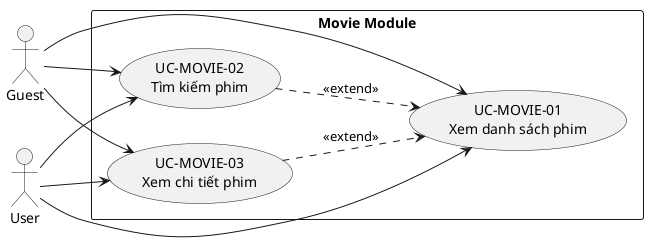
```plantuml
@startuml Movie_UseCase

left to right direction
skinparam packageStyle rectangle

actor "Guest" as Guest
actor "User" as User

rectangle "Movie Module" {
    usecase "UC-MOVIE-01\nXem danh sách phim" as UC1
    usecase "UC-MOVIE-02\nTìm kiếm phim" as UC2
    usecase "UC-MOVIE-03\nXem chi tiết phim" as UC3
}

Guest --> UC1
Guest --> UC2
Guest --> UC3
User --> UC1
User --> UC2
User --> UC3

UC2 ..> UC1 : <<extend>>
UC3 ..> UC1 : <<extend>>

@enduml
```

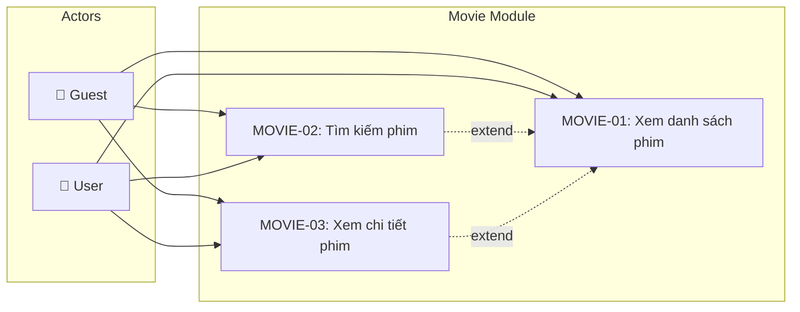
```mermaid
graph LR
    subgraph Actors
        G[👤 Guest]
        U[👥 User]
    end
    
    subgraph "Movie Module"
        UC1[MOVIE-01: Xem danh sách phim]
        UC2[MOVIE-02: Tìm kiếm phim]
        UC3[MOVIE-03: Xem chi tiết phim]
    end
    
    G --> UC1
    G --> UC2
    G --> UC3
    U --> UC1
    U --> UC2
    U --> UC3
    
    UC2 -.->|extend| UC1
    UC3 -.->|extend| UC1
```

---

### UC-MOVIE-01: Xem danh sách phim

| Thuộc tính | Mô tả |
|------------|-------|
| **ID** | UC-MOVIE-01 |
| **Tên** | Xem danh sách phim |
| **Actor chính** | Guest, User |
| **Mô tả** | Hiển thị danh sách các phim đang chiếu |
| **Trigger** | Người dùng truy cập trang chủ |

**Preconditions:**
- Trang web đã tải hoàn chỉnh
- Database có dữ liệu phim

**Main Flow:**
1. Người dùng truy cập trang chủ
2. Hệ thống gọi API lấy danh sách phim
3. Hiển thị các movie cards dạng grid
4. Mỗi card hiển thị: poster, tên phim, rating

**Postconditions:**
- Danh sách phim được hiển thị
- Mỗi card có thể click để xem chi tiết

**Test Case:** `[MOVIE]-01: Verify Movie List Display`

---

### UC-MOVIE-02: Tìm kiếm phim

| Thuộc tính | Mô tả |
|------------|-------|
| **ID** | UC-MOVIE-02 |
| **Tên** | Tìm kiếm phim |
| **Actor chính** | Guest, User |
| **Mô tả** | Tìm kiếm phim theo tên |
| **Trigger** | Người dùng nhập từ khóa vào ô tìm kiếm |

**Preconditions:**
- Trang chủ đã tải
- Có ô tìm kiếm trên navigation

**Main Flow:**
1. Người dùng nhấn icon tìm kiếm (`data-testid="search-toggle"`)
2. Ô tìm kiếm xuất hiện
3. Người dùng nhập tên phim
4. Hệ thống lọc danh sách phim theo từ khóa
5. Hiển thị kết quả phù hợp

**Postconditions:**
- Danh sách phim được lọc theo từ khóa
- Chỉ hiển thị phim có tên chứa từ khóa

**Test Case:** `[MOVIE]-02: Search Movie Functionality`

---

### UC-MOVIE-03: Xem chi tiết phim

| Thuộc tính | Mô tả |
|------------|-------|
| **ID** | UC-MOVIE-03 |
| **Tên** | Xem chi tiết phim |
| **Actor chính** | Guest, User |
| **Mô tả** | Xem thông tin chi tiết của một phim |
| **Trigger** | Người dùng click vào movie card |

**Preconditions:**
- Danh sách phim đang hiển thị
- Phim tồn tại trong database

**Main Flow:**
1. Người dùng click vào movie card (`a.movie-card`)
2. Hệ thống điều hướng đến trang chi tiết phim
3. Hiển thị thông tin: tên phim (h1), storyline, trailer
4. Hiển thị nút "Book Tickets"

**Postconditions:**
- Trang chi tiết phim được hiển thị
- Nút đặt vé có thể tương tác

**Test Case:** `[MOVIE]-03: View Movie Details`

---

## 6. MODULE BOOKING [BOOKING]

### 6.1. Sơ đồ Usecase Module Booking

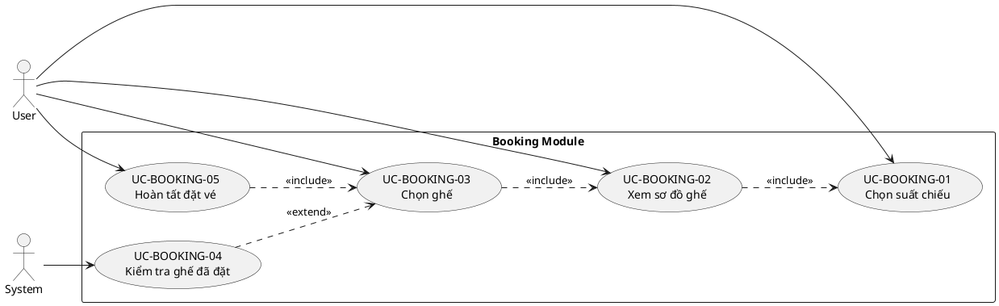
```plantuml
@startuml Booking_UseCase

left to right direction
skinparam packageStyle rectangle

actor "User" as User
actor "System" as System

rectangle "Booking Module" {
    usecase "UC-BOOKING-01\nChọn suất chiếu" as UC1
    usecase "UC-BOOKING-02\nXem sơ đồ ghế" as UC2
    usecase "UC-BOOKING-03\nChọn ghế" as UC3
    usecase "UC-BOOKING-04\nKiểm tra ghế đã đặt" as UC4
    usecase "UC-BOOKING-05\nHoàn tất đặt vé" as UC5
}

User --> UC1
User --> UC2
User --> UC3
User --> UC5
System --> UC4

UC2 ..> UC1 : <<include>>
UC3 ..> UC2 : <<include>>
UC5 ..> UC3 : <<include>>
UC4 ..> UC3 : <<extend>>

@enduml
```

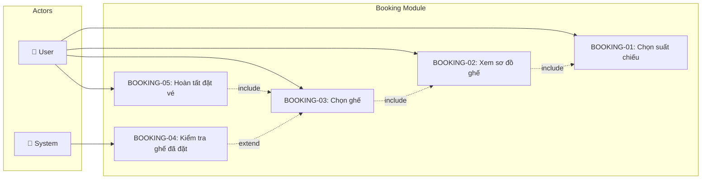
```mermaid
graph LR
    subgraph Actors
        U[👥 User]
        S[🔧 System]
    end
    
    subgraph "Booking Module"
        UC1[BOOKING-01: Chọn suất chiếu]
        UC2[BOOKING-02: Xem sơ đồ ghế]
        UC3[BOOKING-03: Chọn ghế]
        UC4[BOOKING-04: Kiểm tra ghế đã đặt]
        UC5[BOOKING-05: Hoàn tất đặt vé]
    end
    
    U --> UC1
    U --> UC2
    U --> UC3
    U --> UC5
    S --> UC4
    
    UC2 -.->|include| UC1
    UC3 -.->|include| UC2
    UC5 -.->|include| UC3
    UC4 -.->|extend| UC3
```

---

### UC-BOOKING-01: Chọn suất chiếu

| Thuộc tính | Mô tả |
|------------|-------|
| **ID** | UC-BOOKING-01 |
| **Tên** | Chọn suất chiếu |
| **Actor chính** | User |
| **Mô tả** | Người dùng chọn suất chiếu cho phim |
| **Trigger** | Người dùng nhấn "Book Tickets" trên trang chi tiết phim |

**Preconditions:**
- Người dùng đã đăng nhập
- Đang ở trang chi tiết phim
- Có suất chiếu khả dụng

**Main Flow:**
1. Người dùng nhấn "Book Tickets"
2. Hiển thị danh sách suất chiếu (ngày, giờ, rạp)
3. Người dùng chọn một suất chiếu
4. Chuyển sang trang chọn ghế

**Postconditions:**
- Suất chiếu được chọn
- Chuyển đến trang sơ đồ ghế

**Test Case:** `[BOOKING]-01: Chọn suất chiếu`

---

### UC-BOOKING-02: Xem sơ đồ ghế

| Thuộc tính | Mô tả |
|------------|-------|
| **ID** | UC-BOOKING-02 |
| **Tên** | Hiển thị sơ đồ ghế |
| **Actor chính** | User |
| **Mô tả** | Hiển thị sơ đồ ghế ngồi của rạp |
| **Trigger** | Sau khi chọn suất chiếu |

**Preconditions:**
- Suất chiếu đã được chọn
- Thông tin rạp và ghế có sẵn

**Main Flow:**
1. Hệ thống tải thông tin ghế từ database
2. Hiển thị sơ đồ ghế theo hàng và cột
3. Hiển thị chú thích: Available, Selected, Taken
4. Ghế đã đặt được đánh dấu disabled

**Postconditions:**
- Sơ đồ ghế hiển thị đầy đủ
- Trạng thái ghế được phân biệt rõ ràng

**Test Case:** `[BOOKING]-02: Hiển thị sơ đồ ghế`

---

### UC-BOOKING-03: Chọn ghế

| Thuộc tính | Mô tả |
|------------|-------|
| **ID** | UC-BOOKING-03 |
| **Tên** | Chọn ghế |
| **Actor chính** | User |
| **Mô tả** | Người dùng chọn ghế ngồi |
| **Trigger** | Người dùng click vào ghế trống |

**Preconditions:**
- Sơ đồ ghế đang hiển thị
- Có ghế trống (available)

**Main Flow:**
1. Người dùng click vào ghế trống
2. Ghế đổi màu thành "selected"
3. Tổng tiền được cập nhật
4. Có thể chọn nhiều ghế

**Postconditions:**
- Ghế được đánh dấu selected
- Tổng tiền hiển thị chính xác

**Test Case:** `[BOOKING]-03: Chọn ghế`

---

### UC-BOOKING-04: Kiểm tra ghế đã đặt

| Thuộc tính | Mô tả |
|------------|-------|
| **ID** | UC-BOOKING-04 |
| **Tên** | Không chọn được ghế đã đặt |
| **Actor chính** | System |
| **Mô tả** | Hệ thống ngăn không cho chọn ghế đã được đặt |
| **Trigger** | Người dùng cố click vào ghế đã đặt |

**Preconditions:**
- Có ghế đã được đặt trong suất chiếu

**Main Flow:**
1. Hệ thống đánh dấu ghế đã đặt là "taken"
2. Ghế bị disabled, không thể click
3. Nếu người dùng cố click, không có phản hồi

**Postconditions:**
- Ghế đã đặt không thể chọn
- Tránh xung đột đặt vé

**Test Case:** `[BOOKING]-04: Không chọn được ghế đã đặt`

---

### UC-BOOKING-05: Hoàn tất đặt vé

| Thuộc tính | Mô tả |
|------------|-------|
| **ID** | UC-BOOKING-05 |
| **Tên** | Hoàn tất đặt vé |
| **Actor chính** | User |
| **Mô tả** | Người dùng xác nhận và tiến hành thanh toán |
| **Trigger** | Người dùng nhấn "Proceed to Payment" |

**Preconditions:**
- Đã chọn ít nhất 1 ghế
- Tổng tiền > 0

**Main Flow:**
1. Người dùng xác nhận ghế đã chọn
2. Nhấn "Proceed to Payment"
3. Chuyển sang màn hình thanh toán
4. Hoàn tất thanh toán
5. Hiển thị thông báo thành công

**Postconditions:**
- Booking được tạo trong database
- Ghế bị đánh dấu đã đặt
- Hiển thị chi tiết vé

**Test Case:** `[BOOKING]-05: Hoàn tất đặt vé`

---

## 7. MODULE PAYMENT [PAYMENT]

### 7.1. Sơ đồ Usecase Module Payment

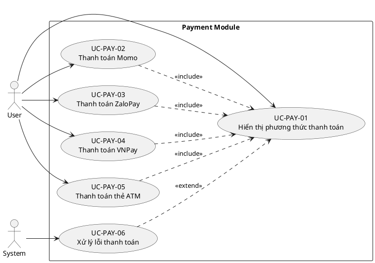
```plantuml
@startuml Payment_UseCase

left to right direction
skinparam packageStyle rectangle

actor "User" as User
actor "System" as System

rectangle "Payment Module" {
    usecase "UC-PAY-01\nHiển thị phương thức thanh toán" as UC1
    usecase "UC-PAY-02\nThanh toán Momo" as UC2
    usecase "UC-PAY-03\nThanh toán ZaloPay" as UC3
    usecase "UC-PAY-04\nThanh toán VNPay" as UC4
    usecase "UC-PAY-05\nThanh toán thẻ ATM" as UC5
    usecase "UC-PAY-06\nXử lý lỗi thanh toán" as UC6
}

User --> UC1
User --> UC2
User --> UC3
User --> UC4
User --> UC5
System --> UC6

UC2 ..> UC1 : <<include>>
UC3 ..> UC1 : <<include>>
UC4 ..> UC1 : <<include>>
UC5 ..> UC1 : <<include>>
UC6 ..> UC1 : <<extend>>

@enduml
```

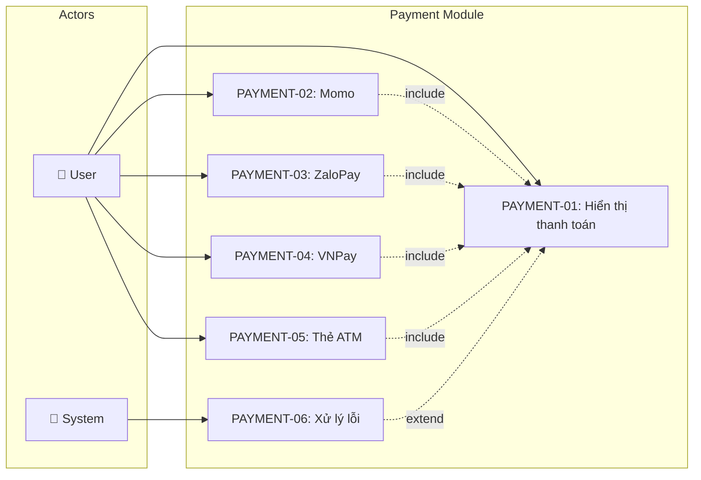
```mermaid
graph LR
    subgraph Actors
        U[👥 User]
        S[🔧 System]
    end
    
    subgraph "Payment Module"
        UC1[PAYMENT-01: Hiển thị thanh toán]
        UC2[PAYMENT-02: Momo]
        UC3[PAYMENT-03: ZaloPay]
        UC4[PAYMENT-04: VNPay]
        UC5[PAYMENT-05: Thẻ ATM]
        UC6[PAYMENT-06: Xử lý lỗi]
    end
    
    U --> UC1
    U --> UC2
    U --> UC3
    U --> UC4
    U --> UC5
    S --> UC6
    
    UC2 -.->|include| UC1
    UC3 -.->|include| UC1
    UC4 -.->|include| UC1
    UC5 -.->|include| UC1
    UC6 -.->|extend| UC1
```

---

### UC-PAY-01: Hiển thị màn hình thanh toán

| Thuộc tính | Mô tả |
|------------|-------|
| **ID** | UC-PAY-01 |
| **Tên** | Hiển thị màn hình thanh toán |
| **Actor chính** | User |
| **Mô tả** | Hiển thị các phương thức thanh toán có sẵn |
| **Trigger** | Sau khi chọn ghế và nhấn tiếp tục |

**Preconditions:**
- Đã chọn ghế ngồi
- Có tổng tiền cần thanh toán

**Main Flow:**
1. Modal thanh toán hiển thị
2. Hiển thị 4 phương thức: Momo, ZaloPay, VNPay, Thẻ ATM
3. Hiển thị tổng tiền cần thanh toán
4. Momo được chọn mặc định

**Postconditions:**
- Modal thanh toán hiển thị đầy đủ
- Người dùng có thể chọn phương thức

**Test Case:** `[PAYMENT]-01: Hiển thị màn hình thanh toán`

---

### UC-PAY-02 đến UC-PAY-05: Thanh toán theo phương thức

| ID | Phương thức | Quy trình đặc biệt |
|----|-------------|-------------------|
| UC-PAY-02 | Ví Momo | Click Momo → Thanh Toán |
| UC-PAY-03 | Ví ZaloPay | Click ZaloPay → Thanh Toán |
| UC-PAY-04 | Ví VNPay | Click VNPay → Thanh Toán |
| UC-PAY-05 | Thẻ ATM | Nhập số thẻ, tên, ngày hết hạn, CVV → Thanh Toán |

**Main Flow chung:**
1. Chọn phương thức thanh toán
2. Điền thông tin (nếu cần - ATM)
3. Nhấn "Thanh Toán"
4. Hệ thống xử lý thanh toán
5. Hiển thị "Thanh toán thành công"

**Postconditions:**
- Thanh toán hoàn tất
- Booking được xác nhận
- Vé được tạo

---

### UC-PAY-06: Xử lý lỗi thanh toán

| Thuộc tính | Mô tả |
|------------|-------|
| **ID** | UC-PAY-06 |
| **Tên** | Xử lý lỗi mạng khi thanh toán |
| **Actor chính** | System |
| **Mô tả** | Xử lý khi có lỗi trong quá trình thanh toán |
| **Trigger** | Lỗi mạng hoặc thông tin không hợp lệ |

**Main Flow:**
1. Thanh toán thất bại (lỗi mạng/thông tin sai)
2. Hiển thị thông báo lỗi
3. Modal thanh toán vẫn mở
4. Người dùng có thể thử lại

**Test Case:** `[PAYMENT]-06: Xử lý lỗi mạng khi thanh toán`

---

## 8. MODULE ADMIN [ADMIN]

### 8.1. Sơ đồ Usecase Module Admin

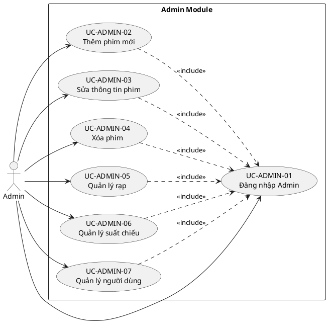
```plantuml
@startuml Admin_UseCase

left to right direction
skinparam packageStyle rectangle

actor "Admin" as Admin

rectangle "Admin Module" {
    usecase "UC-ADMIN-01\nĐăng nhập Admin" as UC1
    usecase "UC-ADMIN-02\nThêm phim mới" as UC2
    usecase "UC-ADMIN-03\nSửa thông tin phim" as UC3
    usecase "UC-ADMIN-04\nXóa phim" as UC4
    usecase "UC-ADMIN-05\nQuản lý rạp" as UC5
    usecase "UC-ADMIN-06\nQuản lý suất chiếu" as UC6
    usecase "UC-ADMIN-07\nQuản lý người dùng" as UC7
}

Admin --> UC1
Admin --> UC2
Admin --> UC3
Admin --> UC4
Admin --> UC5
Admin --> UC6
Admin --> UC7

UC2 ..> UC1 : <<include>>
UC3 ..> UC1 : <<include>>
UC4 ..> UC1 : <<include>>
UC5 ..> UC1 : <<include>>
UC6 ..> UC1 : <<include>>
UC7 ..> UC1 : <<include>>

@enduml
```

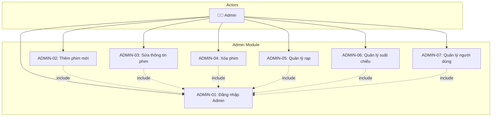
```mermaid
graph TB
    subgraph Actors
        A[👨‍💼 Admin]
    end
    
    subgraph "Admin Module"
        UC1[ADMIN-01: Đăng nhập Admin]
        UC2[ADMIN-02: Thêm phim mới]
        UC3[ADMIN-03: Sửa thông tin phim]
        UC4[ADMIN-04: Xóa phim]
        UC5[ADMIN-05: Quản lý rạp]
        UC6[ADMIN-06: Quản lý suất chiếu]
        UC7[ADMIN-07: Quản lý người dùng]
    end
    
    A --> UC1
    A --> UC2
    A --> UC3
    A --> UC4
    A --> UC5
    A --> UC6
    A --> UC7
    
    UC2 -.->|include| UC1
    UC3 -.->|include| UC1
    UC4 -.->|include| UC1
    UC5 -.->|include| UC1
    UC6 -.->|include| UC1
    UC7 -.->|include| UC1
```

---

### UC-ADMIN-01: Đăng nhập Admin

| Thuộc tính | Mô tả |
|------------|-------|
| **ID** | UC-ADMIN-01 |
| **Tên** | Đăng nhập Admin |
| **Actor chính** | Admin |
| **Mô tả** | Quản trị viên đăng nhập vào trang quản trị |
| **Trigger** | Admin truy cập /admin hoặc đăng nhập với tài khoản admin |

**Preconditions:**
- Tài khoản có role = "admin"
- Đang ở trang chủ hoặc trang login

**Main Flow:**
1. Admin nhấn nút Login
2. Nhập email và password của admin
3. Hệ thống xác thực và kiểm tra role
4. Chuyển hướng đến /admin
5. Hiển thị Dashboard với các tab: Movies, Theaters, Showtimes, Users

**Postconditions:**
- Admin truy cập được trang quản trị
- Hiển thị các chức năng quản lý

**Test Case:** `[ADMIN]-01: Đăng nhập admin`

---

### UC-ADMIN-02: Thêm phim mới

| Thuộc tính | Mô tả |
|------------|-------|
| **ID** | UC-ADMIN-02 |
| **Tên** | Thêm phim mới |
| **Actor chính** | Admin |
| **Mô tả** | Thêm phim mới vào hệ thống |
| **Trigger** | Admin nhấn nút "Add" trong tab Movies |

**Preconditions:**
- Đã đăng nhập với quyền Admin
- Đang ở trang quản lý phim

**Main Flow:**
1. Admin click vào tab "Movies"
2. Nhấn nút "Add" / "Create"
3. Điền form thông tin phim:
   - Title (bắt buộc)
   - Description
   - Genre (Action, Drama, ...)
   - Duration (phút)
   - Rating (0-10)
   - Release Date
   - Poster URL
   - Trailer URL
   - Director
   - Cast
4. Nhấn "Save" / "Create"
5. Hiển thị thông báo thành công
6. Phim mới xuất hiện trong danh sách

**Postconditions:**
- Phim được lưu vào database
- Danh sách phim được cập nhật

**Test Case:** `[ADMIN]-02: Thêm phim mới`

---

### UC-ADMIN-03: Sửa thông tin phim

| Thuộc tính | Mô tả |
|------------|-------|
| **ID** | UC-ADMIN-03 |
| **Tên** | Sửa thông tin phim |
| **Actor chính** | Admin |
| **Mô tả** | Chỉnh sửa thông tin phim đã có |
| **Trigger** | Admin nhấn nút "Edit" trên movie card |

**Preconditions:**
- Phim đã tồn tại trong hệ thống
- Đang ở trang quản lý phim

**Main Flow:**
1. Admin hover vào movie card
2. Nút "Edit" xuất hiện
3. Admin click "Edit"
4. Form chỉnh sửa mở với dữ liệu hiện tại
5. Admin chỉnh sửa các trường cần thiết
6. Nhấn "Save"
7. Hiển thị thông báo thành công

**Postconditions:**
- Thông tin phim được cập nhật
- Danh sách phim phản ánh thay đổi

**Test Case:** `[ADMIN]-03: Sửa thông tin phim`

---

## 9. MODULE PROFILE [PROFILE]

### 9.1. Sơ đồ Usecase Module Profile

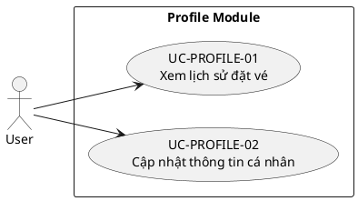
```plantuml
@startuml Profile_UseCase

left to right direction
skinparam packageStyle rectangle

actor "User" as User

rectangle "Profile Module" {
    usecase "UC-PROFILE-01\nXem lịch sử đặt vé" as UC1
    usecase "UC-PROFILE-02\nCập nhật thông tin cá nhân" as UC2
}

User --> UC1
User --> UC2

@enduml
```

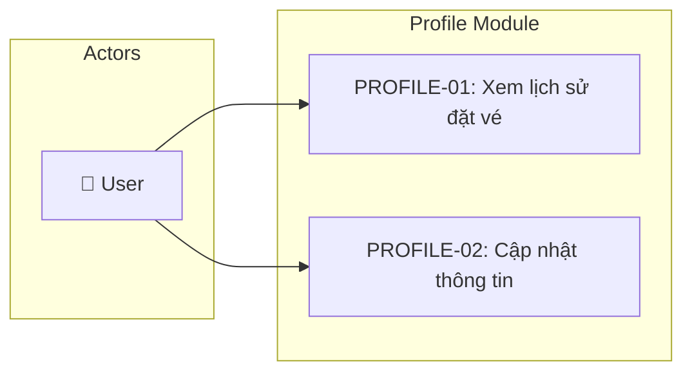
```mermaid
graph LR
    subgraph Actors
        U[👥 User]
    end
    
    subgraph "Profile Module"
        UC1[PROFILE-01: Xem lịch sử đặt vé]
        UC2[PROFILE-02: Cập nhật thông tin]
    end
    
    U --> UC1
    U --> UC2
```

---

### UC-PROFILE-01: Xem lịch sử đặt vé

| Thuộc tính | Mô tả |
|------------|-------|
| **ID** | UC-PROFILE-01 |
| **Tên** | Xem lịch sử đặt vé |
| **Actor chính** | User |
| **Mô tả** | Xem danh sách các vé đã đặt |
| **Trigger** | Người dùng truy cập trang Profile |

**Main Flow:**
1. Người dùng click vào "Profile" / "My Bookings"
2. Hệ thống lấy danh sách booking của user
3. Hiển thị danh sách vé: phim, rạp, suất chiếu, ghế, giá
4. Nếu chưa có vé: hiển thị "No bookings found"

**Test Case:** `[PROFILE]-01: Xem lịch sử đặt vé`

---

### UC-PROFILE-02: Cập nhật thông tin cá nhân

| Thuộc tính | Mô tả |
|------------|-------|
| **ID** | UC-PROFILE-02 |
| **Tên** | Cập nhật thông tin cá nhân |
| **Actor chính** | User |
| **Mô tả** | Chỉnh sửa thông tin profile |
| **Trigger** | Người dùng nhấn "Edit Profile" |

**Main Flow:**
1. Người dùng vào trang Profile
2. Nhấn "Edit Profile"
3. Modal chỉnh sửa xuất hiện
4. Điền tên mới và thông tin khác
5. Nhấn "Save Changes"
6. Hiển thị "Profile updated successfully"

**Test Case:** `[PROFILE]-02: Cập nhật thông tin cá nhân`

---

## 10. MODULE SYSTEM [SYS]

### 10.1. Sơ đồ Usecase Module System

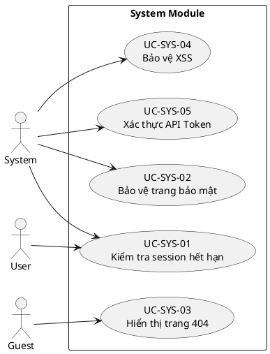
```plantuml
@startuml System_UseCase

left to right direction
skinparam packageStyle rectangle

actor "System" as System
actor "User" as User
actor "Guest" as Guest

rectangle "System Module" {
    usecase "UC-SYS-01\nKiểm tra session hết hạn" as UC1
    usecase "UC-SYS-02\nBảo vệ trang bảo mật" as UC2
    usecase "UC-SYS-03\nHiển thị trang 404" as UC3
    usecase "UC-SYS-04\nBảo vệ XSS" as UC4
    usecase "UC-SYS-05\nXác thực API Token" as UC5
}

System --> UC1
System --> UC2
System --> UC4
System --> UC5
Guest --> UC3
User --> UC1

@enduml
```

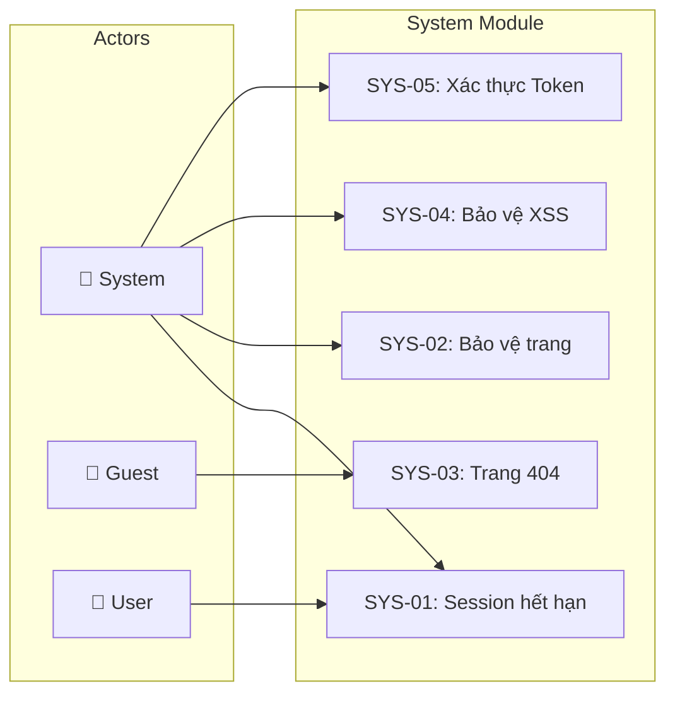
```mermaid
graph LR
    subgraph Actors
        S[🔧 System]
        G[👤 Guest]
        U[👥 User]
    end
    
    subgraph "System Module"
        UC1[SYS-01: Session hết hạn]
        UC2[SYS-02: Bảo vệ trang]
        UC3[SYS-03: Trang 404]
        UC4[SYS-04: Bảo vệ XSS]
        UC5[SYS-05: Xác thực Token]
    end
    
    S --> UC1
    S --> UC2
    S --> UC4
    S --> UC5
    G --> UC3
    U --> UC1
```

---

### UC-SYS-01: Kiểm tra session hết hạn

| Thuộc tính | Mô tả |
|------------|-------|
| **ID** | UC-SYS-01 |
| **Tên** | Kiểm thử phiên đăng nhập hết hạn |
| **Actor chính** | System |
| **Mô tả** | Xử lý khi JWT token hết hạn |

**Main Flow:**
1. Token trong localStorage hết hạn
2. User cố truy cập trang bảo mật
3. Hệ thống phát hiện token invalid
4. Xóa token và redirect về trang login
5. Hiển thị form đăng nhập

**Test Case:** `[SYS]-01: Kiểm thử phiên đăng nhập hết hạn`

---

### UC-SYS-02: Bảo vệ trang bảo mật

| Thuộc tính | Mô tả |
|------------|-------|
| **ID** | UC-SYS-02 |
| **Tên** | Kiểm thử truy cập trang bảo mật khi chưa đăng nhập |
| **Actor chính** | System |
| **Mô tả** | Ngăn truy cập trang admin/profile khi chưa đăng nhập |

**Main Flow:**
1. Guest cố truy cập /admin
2. Hệ thống kiểm tra không có token
3. Hiển thị "Access Denied" hoặc redirect về login

**Test Case:** `[SYS]-02: Kiểm thử truy cập trang bảo mật khi chưa đăng nhập`

---

### UC-SYS-03: Hiển thị trang 404

| Thuộc tính | Mô tả |
|------------|-------|
| **ID** | UC-SYS-03 |
| **Tên** | Kiểm thử link không tồn tại |
| **Actor chính** | Guest, User |
| **Mô tả** | Hiển thị trang 404 khi truy cập URL không tồn tại |

**Main Flow:**
1. User truy cập URL không tồn tại (ví dụ: /randomxyz)
2. Hệ thống hiển thị trang 404
3. Hiển thị thông báo "Page not found"
4. Có nút quay về trang chủ

**Test Case:** `[SYS]-03: Kiểm thử link không tồn tại`

---

### UC-SYS-04: Bảo vệ XSS

| Thuộc tính | Mô tả |
|------------|-------|
| **ID** | UC-SYS-04 |
| **Tên** | Bảo mật - Nhập mã độc XSS |
| **Actor chính** | System |
| **Mô tả** | Ngăn chặn tấn công XSS |

**Main Flow:**
1. Attacker cố nhập script độc hại vào input
2. Hệ thống sanitize input
3. Script không được thực thi
4. Dữ liệu được escape trước khi render

**Test Case:** `[SYS]-04: Bảo mật - Nhập mã độc XSS`

---

### UC-SYS-05: Xác thực API Token

| Thuộc tính | Mô tả |
|------------|-------|
| **ID** | UC-SYS-05 |
| **Tên** | Bảo mật - Gọi API không có token |
| **Actor chính** | System |
| **Mô tả** | Từ chối API call không có token hợp lệ |

**Main Flow:**
1. Client gọi API protected mà không có token
2. Server trả về 401 Unauthorized
3. Client hiển thị form đăng nhập

**Test Case:** `[SYS]-05: Bảo mật - Gọi API không có token`

---

## 📊 BẢNG TỔNG HỢP USECASE

| Module | ID | Tên Usecase | Actor | Priority |
|--------|----|-----------  |-------|----------|
| AUTH | UC-AUTH-01 | Hiển thị form đăng nhập | Guest | High |
| AUTH | UC-AUTH-02 | Đăng nhập thành công | Guest | High |
| AUTH | UC-AUTH-03 | Đăng nhập thất bại | System | High |
| AUTH | UC-AUTH-04 | Đăng ký thành công | Guest | High |
| AUTH | UC-AUTH-05 | Đăng ký thất bại | System | High |
| AUTH | UC-AUTH-06 | Đăng xuất | User | High |
| MOVIE | UC-MOVIE-01 | Xem danh sách phim | Guest/User | High |
| MOVIE | UC-MOVIE-02 | Tìm kiếm phim | Guest/User | Medium |
| MOVIE | UC-MOVIE-03 | Xem chi tiết phim | Guest/User | High |
| BOOKING | UC-BOOKING-01 | Chọn suất chiếu | User | High |
| BOOKING | UC-BOOKING-02 | Xem sơ đồ ghế | User | High |
| BOOKING | UC-BOOKING-03 | Chọn ghế | User | High |
| BOOKING | UC-BOOKING-04 | Kiểm tra ghế đã đặt | System | High |
| BOOKING | UC-BOOKING-05 | Hoàn tất đặt vé | User | High |
| PAYMENT | UC-PAY-01 | Hiển thị thanh toán | User | High |
| PAYMENT | UC-PAY-02 | Thanh toán Momo | User | High |
| PAYMENT | UC-PAY-03 | Thanh toán ZaloPay | User | Medium |
| PAYMENT | UC-PAY-04 | Thanh toán VNPay | User | Medium |
| PAYMENT | UC-PAY-05 | Thanh toán ATM | User | Medium |
| PAYMENT | UC-PAY-06 | Xử lý lỗi thanh toán | System | High |
| ADMIN | UC-ADMIN-01 | Đăng nhập Admin | Admin | High |
| ADMIN | UC-ADMIN-02 | Thêm phim mới | Admin | High |
| ADMIN | UC-ADMIN-03 | Sửa thông tin phim | Admin | High |
| ADMIN | UC-ADMIN-04 | Xóa phim | Admin | Medium |
| ADMIN | UC-ADMIN-05 | Quản lý rạp | Admin | High |
| ADMIN | UC-ADMIN-06 | Quản lý suất chiếu | Admin | High |
| ADMIN | UC-ADMIN-07 | Quản lý người dùng | Admin | Medium |
| PROFILE | UC-PROFILE-01 | Xem lịch sử đặt vé | User | Medium |
| PROFILE | UC-PROFILE-02 | Cập nhật thông tin | User | Medium |
| SYSTEM | UC-SYS-01 | Session hết hạn | System | High |
| SYSTEM | UC-SYS-02 | Bảo vệ trang bảo mật | System | High |
| SYSTEM | UC-SYS-03 | Trang 404 | Guest/User | Low |
| SYSTEM | UC-SYS-04 | Bảo vệ XSS | System | High |
| SYSTEM | UC-SYS-05 | Xác thực API Token | System | High |

---

## 📁 PHỤ LỤC

### A. Công cụ vẽ sơ đồ gợi ý

1. **PlantUML** - https://plantuml.com/
2. **Draw.io** - https://draw.io/
3. **Lucidchart** - https://lucidchart.com/
4. **Visual Paradigm** - https://visual-paradigm.com/
5. **StarUML** - https://staruml.io/

### B. Cách sử dụng PlantUML

1. Copy code PlantUML trong tài liệu
2. Truy cập https://www.plantuml.com/plantuml/uml/
3. Paste code và nhấn Submit
4. Download hình ảnh

### C. Cách sử dụng Mermaid (GitHub)

Mermaid được hỗ trợ natively trên GitHub. Chỉ cần:
1. Tạo file .md với cú pháp ```mermaid
2. GitHub sẽ tự render thành sơ đồ

---

> **Tác giả:** CinemaVision Pro Team  
> **Cập nhật lần cuối:** 10/12/2024
